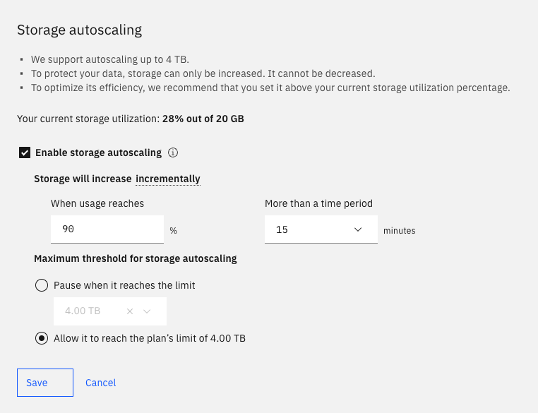
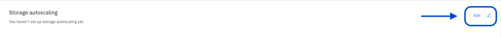
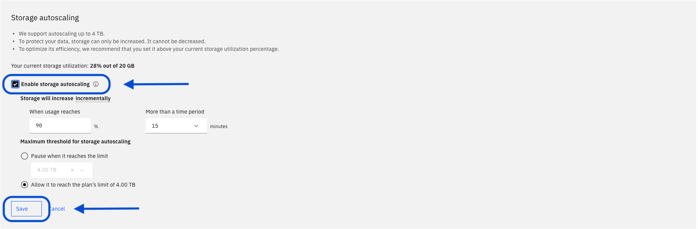

---

copyright:
  years: 2014, 2025
lastupdated: "2025-04-10"

keywords:

subcollection: Db2onCloud

---

{:external: target="_blank" .external}
{:shortdesc: .shortdesc}
{:codeblock: .codeblock}
{:screen: .screen}
{:tip: .tip}
{:important: .important}
{:note: .note}
{:deprecated: .deprecated}
{:pre: .pre}

# Auto-scaling

When you enable autoscaling, the storage on your Db2 on Cloud instance will automatically be scaled up if your storage use exceeds the threshold you specify. For example, you can choose to scale up your storage by 20GB if more than 90% of your storage is in use for a period of 15 minutes.

To monitor your storage usage, use the IBM Cloud® Monitoring integration, which provides metrics for disk space.

## General Autoscaling Parameters

- When to scale, based on usage over time.
- A hard limit on scaling, your deployment stops autoscaling at the limit.

{: caption="Example Autoscaling panel" caption-side="bottom"}

## ****Autoscaling Considerations****

- **Storage cannot be scaled down.**
- Each increment is 10% of your storage size. The minimum increase is 20GB.
- Storage can be auto-scaled up to a limit of 4 TB.
- You must have the IAM Operator, Editor or Administrator authority in order to use this feature.
- If you rarely increase storage on your deployment, you might want to manually scale your deployment rather than enabling the auto-scaling feature.
- Scaling is an online operation.
- Some scaling operations can be more long running than others. Significantly increasing the storage size can take longer than increasing it by a small amount because additional underlying hardware resources must be provisioned.

## ****Configuring Autoscaling in the UI****

The Autoscaling panel is on the Administration tab of your deployment's console page.

### To enable autoscaling
1. Click **Edit**
2. Check **Enable storage autoscaling**
3. Enter your desired parameter values.
4. Be sure to click **Save** for your configuration to be saved and your changes to take effect.

 

### To disable autoscaling
1. Click **Edit**
2. Uncheck **Enable storage autoscaling**.
3. Click **Save Changes** to save the configuration.
