---

copyright:
  years: 2014, 2021
lastupdated: "2021-12-08"

keywords:

subcollection: Db2onCloud

---


{:external: target="_blank" .external}
{:shortdesc: .shortdesc}
{:codeblock: .codeblock}
{:screen: .screen}
{:tip: .tip}
{:important: .important}
{:note: .note}
{:deprecated: .deprecated}
{:pre: .pre}

# Backup and restore
{: #bnr}

## Backup
{: #br_backup}

For paid plans, encrypted backups of the database are done daily. A daily backup is kept for each of the last 14 days.

All paid plans make use of Cross-Regional IBM Cloud Object Storage (COS), by default, to keep backups offsite. {: important}

Changing the backup time can take upto 2 hours to take effect. {: important}

{: shortdesc}

The following is an example of the manual backup operation in the web console UI:

### Enterprise and Standard plans
{: #br_bu_ent_std}

1. Click **Administration** in the left menu and select the **Backups** tab. Click the **Run backup** button.
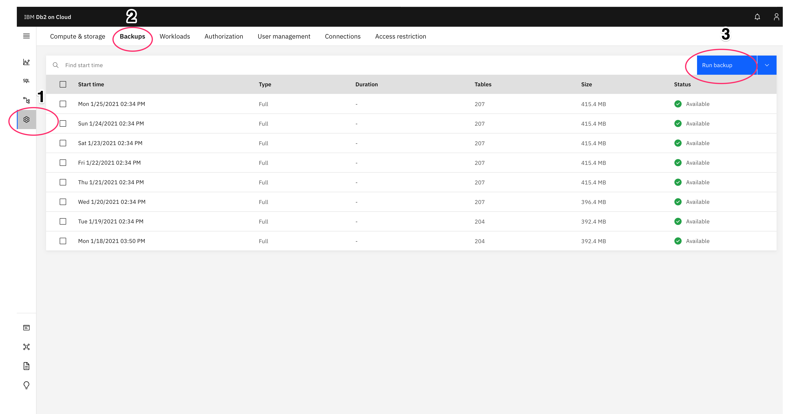{: caption="Selection of the backup option" caption-side="bottom"}

2. Click **Run** to run a manual backup.
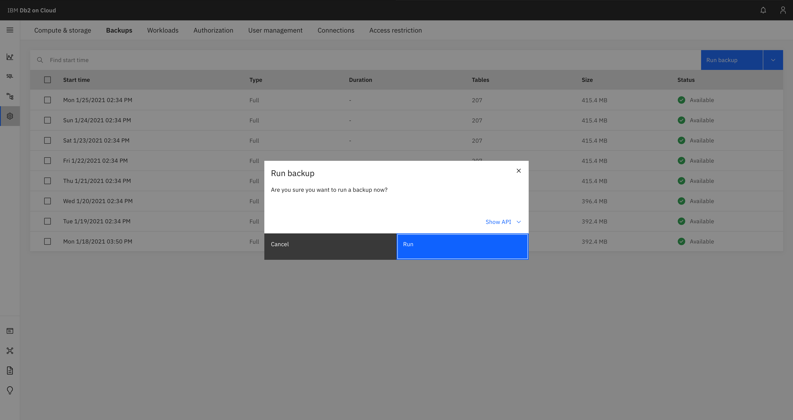{: caption="View of Run backup" caption-side="bottom"}

3. When the backup starts, some features might not be available until the backup is completed.
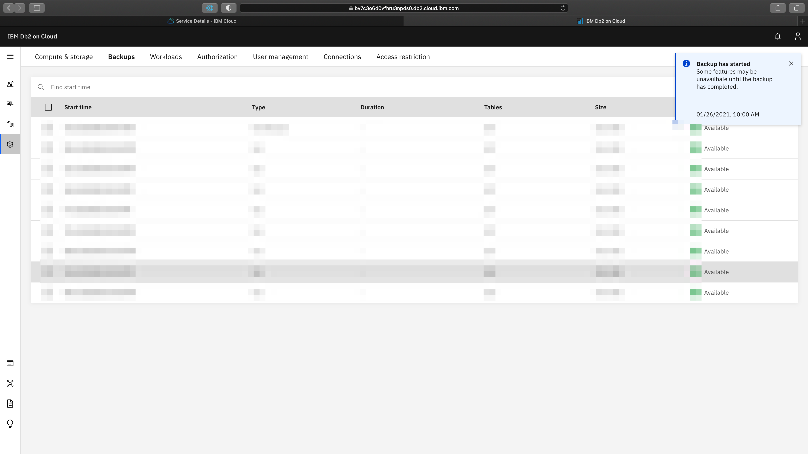{: caption="View of the backup initiation" caption-side="bottom"}

4. After backup completion, a new backup entry in the list of backups appears as a **Full (Manual)** type. The new backup is in an available state.
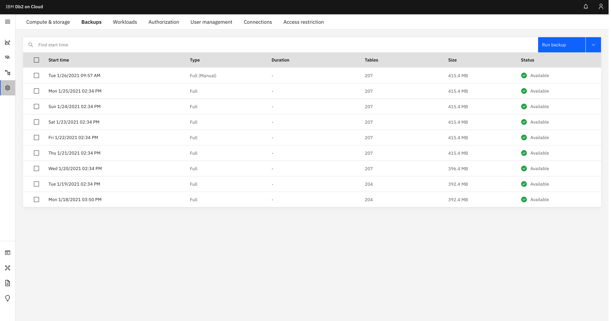{: caption="View of a completed backup" caption-side="bottom"}


## Backup Retention Management
Stored procedures for backup related functionality for db2

Restoring from these retained backups requires opening a support ticket. Users cannot perform self-service restores from these backups.
{: note}

These stored procedures are used to mark backups that we would like to retain and moving them in COS to prevent them from being deleted by the automated cleanup process.

Inversely, functionality is also added to unmark these backups as well in case we realize we don't want them.

Listing functionality is also added to show backups which we have available to us as well as which ones we have marked for retention, a sample output is shown below.

```
BACKUP         PARTS       RETAIN
-------------- ----------- -----------
20240229215327           6           0
20240303215333           6           0
20240304215356           6           0
20240305215330           6           0
20240306215327           6           0
20240307215329           6           0
20240308215332           6           0
20240309215331           6           0
20240310215328           6           0
20240311215329           6           0
20240312215333           6           0
20240313215333           6           0
20240314215324           6           0
20240315215328           6           0
20240316215327           6           0
20240317215328           6           0
20240318215334           6           0
20240303215333           6           1
20240312215333           6           1
```

The parts field will be used to help the customer determine if the backup they created was complete or not.

### Usage

**SAVE_BACKUP**:

`db2 "call SAVE_BACKUP(20240313215333);"`

**REMOVE_SAVED_BACKUP**:

`db2 "call REMOVE_SAVED_BACKUP(20240313215333);"`

**LIST_BACKUP**:

`db2 "select * from table(LIST_BACKUPS());"`

### Restrictions

Any backup which is within 24 hours of being removed (i.e. 1 day or less from exceeding the retention period) will not be saved. This is done as a fail safe to avoid saving large backups which might get removed within the saving process. If this were to happen, this would create garbage/unuseable data into the customers COS, and would require manual cleanup from us.

## Restore
{: #br_restore}

All paid plans make use of Cross-Regional IBM Cloud Object Storage (COS), by default, to keep backups offsite. {: important}

For information about point-in-time restores, see [Point-in-time restore](#point-in-time).


### End-of-backup restore
{: #br_eobrestore}

#### Enterprise and Standard plans
{: #br_eobr_ent_std}

The following is an example of the end-of-backup restore operation in the web console UI:

1. Click **Administration** in the left menu and select the **Backups** tab. Select a backup that you want to restore to end-of-backup and click **Restore**.
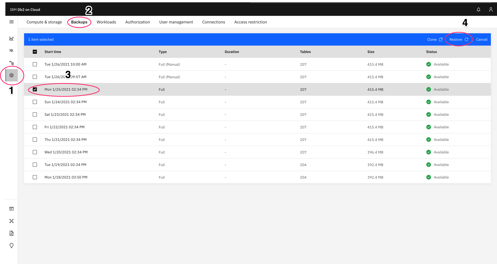{: caption="View of the selection of the end-of-backup restore option" caption-side="bottom"}

2. Click **Restore** to initiate the restore.
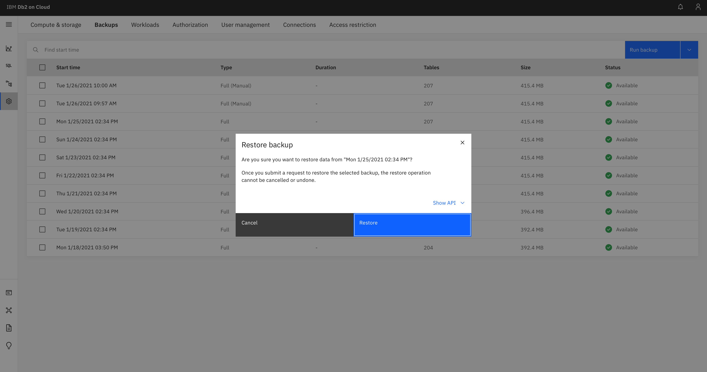{: caption="View of Restore backup" caption-side="bottom"}

3. An information message appears when restore has started. Some features might not be available until restore is completed.
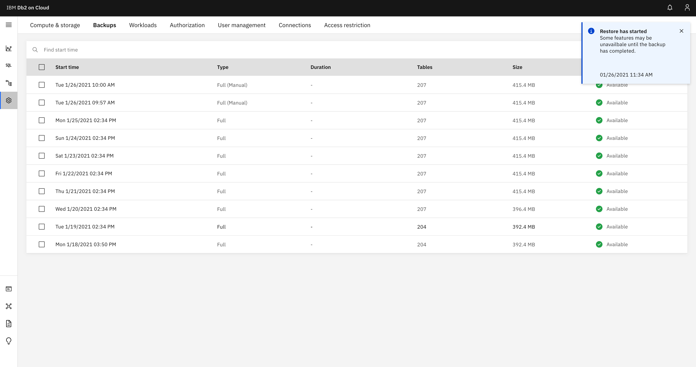{: caption="Start of the end-of-backup restore" caption-side="bottom"}

4. A progress bar indicates the progress of the restore process.
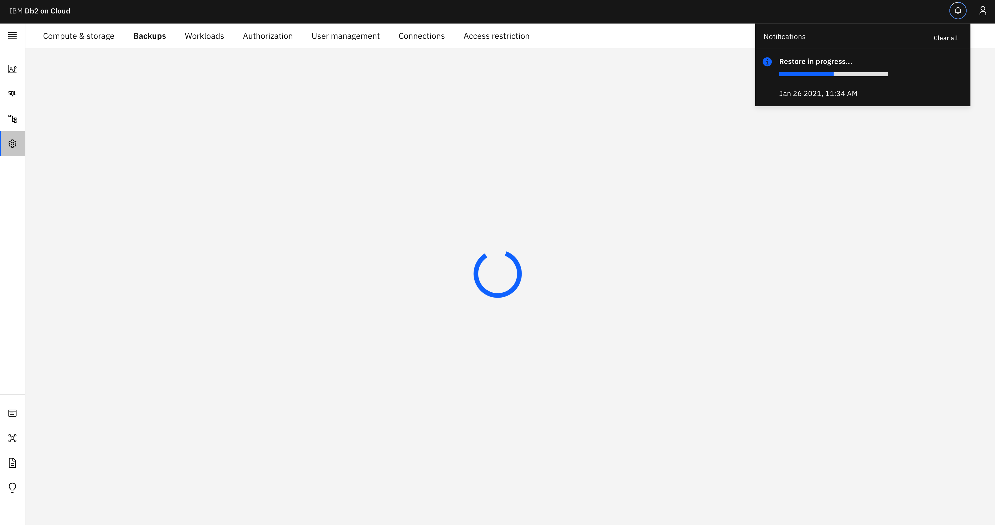{: caption="Progress of the end-of-backup restore" caption-side="bottom"}

5. Notifications show a **Restore success!** message after the restore is completed.
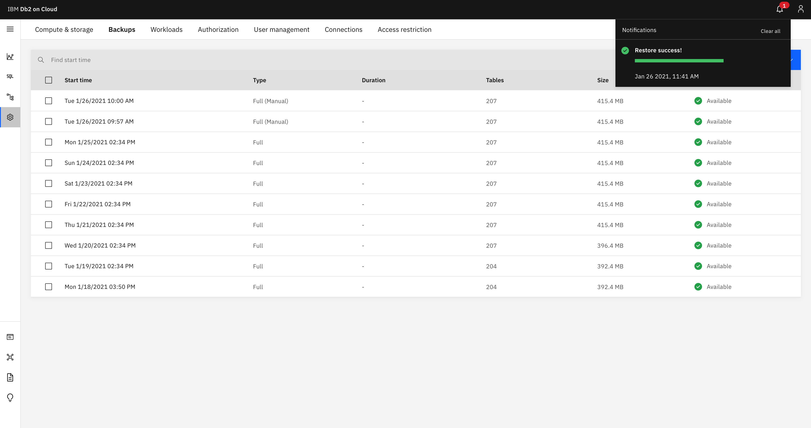{: caption="Successful completion of end-of-backup restore" caption-side="bottom"}

### Point-in-time restore
{: #point-in-time}

{{site.data.keyword.Db2_on_Cloud_short}} added a point-in-time restore capability for systems in {{site.data.keyword.Bluemix_notm}} Public. You can restore to an exact point in time from your backups.

The following are a selected example of screen captures of the point-in-time restore operation in the web console UI:

#### Enterprise and Standard plans
{: #br_pit_ent_std}

1. Click **Administration** in the left menu and select the **Backups** tab.

2. Click the down arrow beside the **Run backup** button. Select **Restore (point-in-time)**.
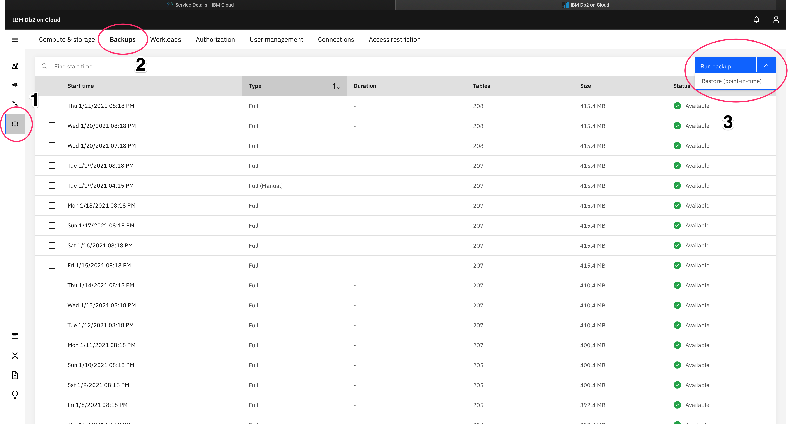{: caption="View of the selection of the point-in-time restore option" caption-side="bottom"}

3. Select a point-in-time date to which you want to restore the database. The point-in-time restore process selects the backup closest to your requested point-in-time date out of the pool of retained backups made during the previous 14 days.

   The point-in-time restore process invalidates any of the previously retained backups with dates after the selected point-in-time date because of a resultant divergence in the timeline.
   {: note}

   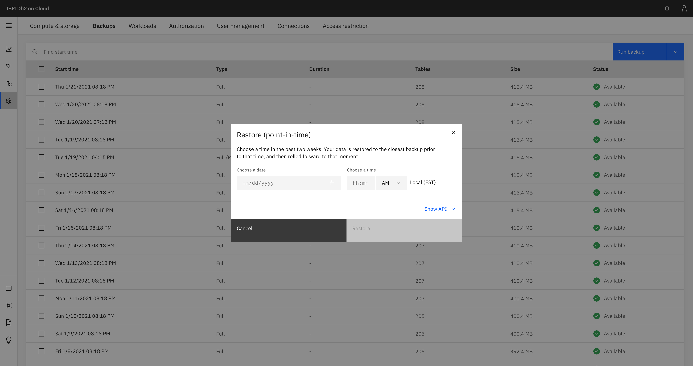{: caption="View of date and time selection for point-in-time restore" caption-side="bottom"}

4. Restoring the database to the selected point in time.
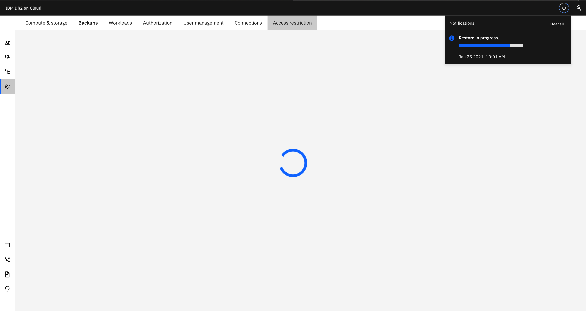{: caption="View of the point-in-time restore initialization" caption-side="bottom"}

5. The restore operation completed successfully.
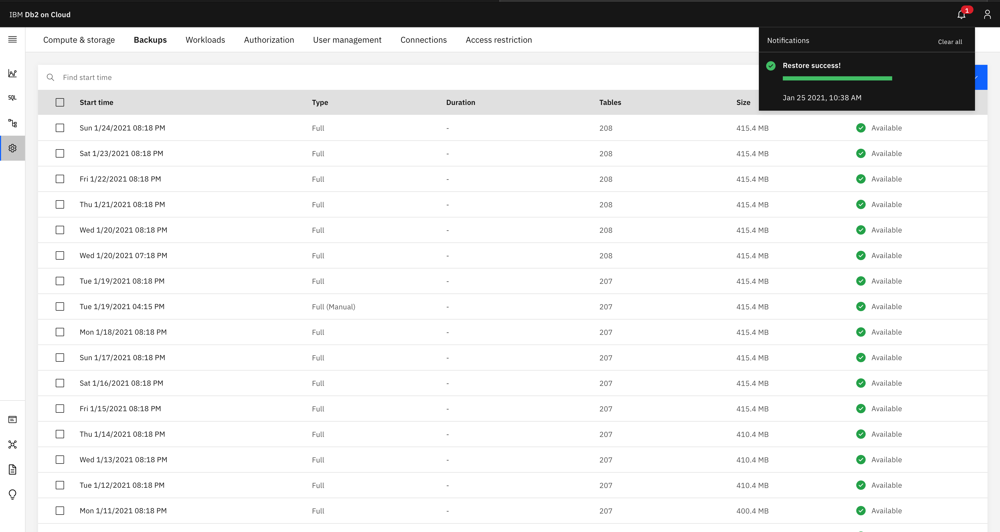{: caption="View of the successful completion of the restoration" caption-side="bottom"}
