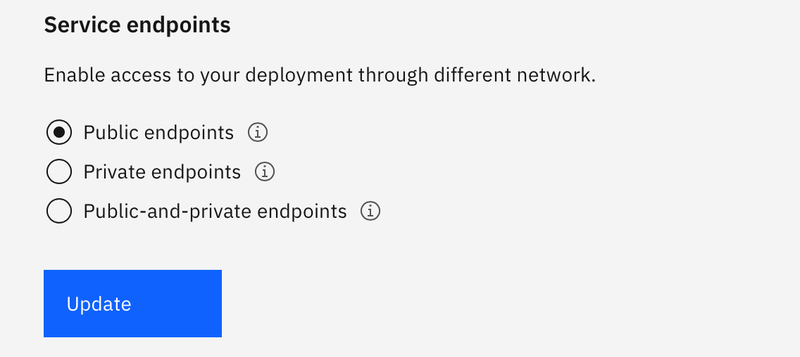

# Endpoints

## Standard and Enterprise Plans
The Standard and Enterprise Plan offer the choice of Public, Private or both Public and Private endpoints.

- Public network service endpoint is accessible from anywhere on the internet. 
- Private network service endpoint access traverses only IBM Cloud backbone network, not public internet.

### Instance Creation 
At instance creation time, the user can pick between there choice of endpoint from the Endpoints box on IBM Cloud.

{: caption="Figure 1. Endpoint choice at instance creation" caption-side="bottom"}

### Changing Endpoints after Creation
The Standard and Enterprise Plans allow changing endpoints at any time, after instance creation.

To change endpoints the following steps must be followed:
- Select your Db2 service from IBM Cloud
- Click on `Open Console` from the Manage tab on the left
- Select `Administration` from the menu on the left 
- Select `Access restriction` from the tab on top
- Select Public Endpoints, Private Endpoints or Public and Private Endpoints 
- Click on `Update` 

The change will be instant once Update is clicked

{: caption="Figure 2. Change Endpoint after instance creation" caption-side="bottom"}

### View Endpoints
To view your endpoints:
- Select your Db2 service from IBM Cloud
- Click on `Open Console` from the Manage tab on the left
- Select `Administration` from the menu on the left 
- Select `Connections` from the tab on top

Endpoint information will be displayed **_Connection Configuration Resources_**

{: caption="Figure 2. Viewing Endpoint Information" caption-side="bottom"}
