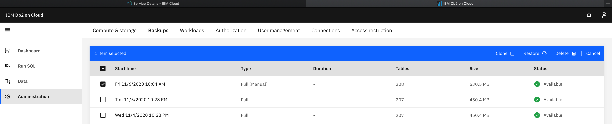
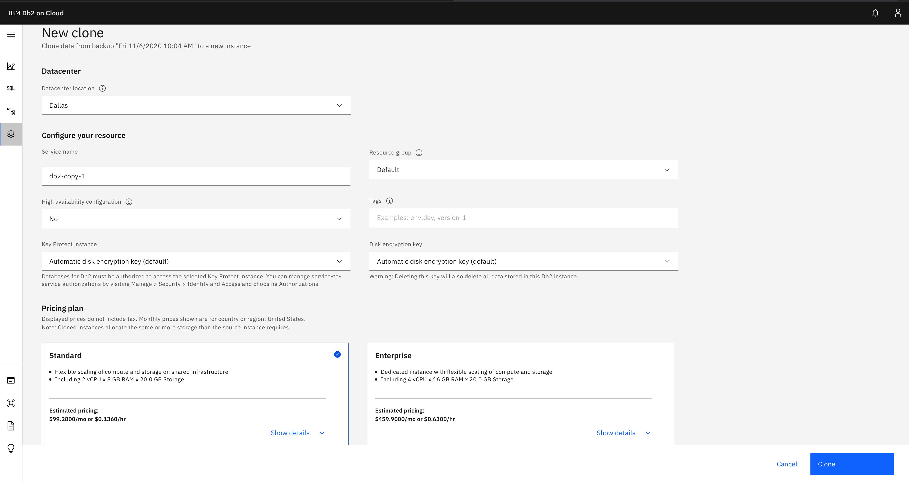
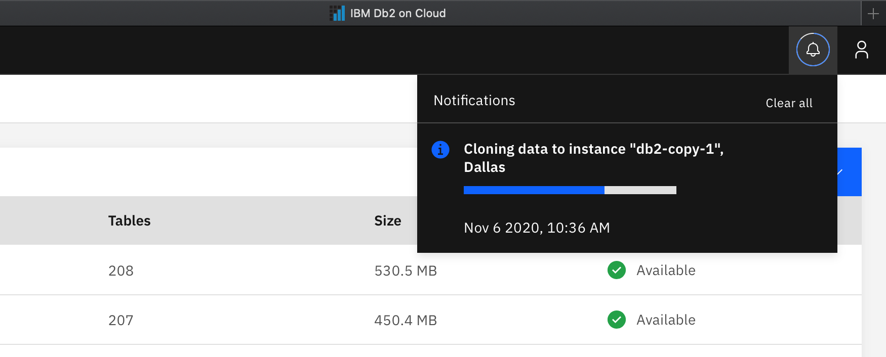
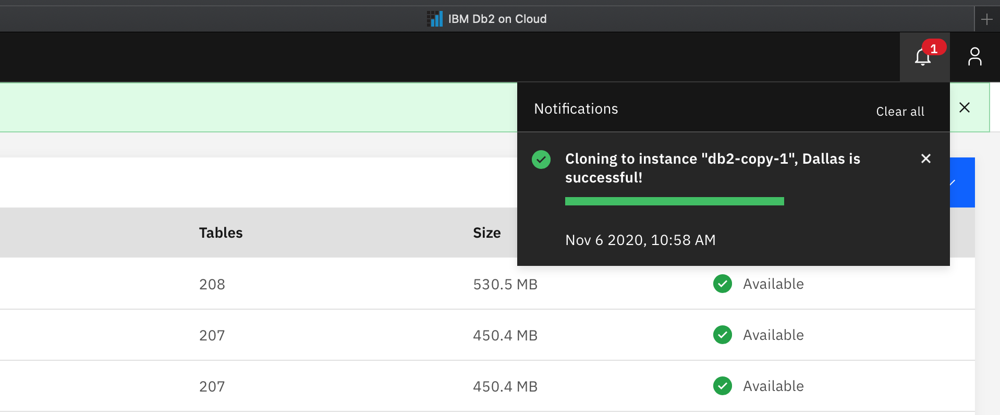

---

copyright:
  years: 2014, 2025
lastupdated: "2025-04-10"

keywords:

subcollection: Db2onCloud

---

{:external: target="_blank" .external}
{:shortdesc: .shortdesc}
{:codeblock: .codeblock}
{:screen: .screen}
{:tip: .tip}
{:important: .important}
{:note: .note}
{:deprecated: .deprecated}
{:pre: .pre}

# Copy Database
{: #cp_db}

The {{site.data.keyword.Db2_on_Cloud_long}} Copy Database feature gives you the ability to copy your existing database to a new instance or easily change plans and instance types.
{: shortdesc}

The following examples are helpful use cases for using a copy of a database:
- Run analytics or reports.
- Make a fresh copy of your production database each morning to use for development purposes.
- Make a *template* database for an app, and make a copy of that template as your apps need it.
- Move from a single node instance to a HA instance or vice versa.
- Move between Standard or Enterprise Plans.

Because the copy instance creates a new instance and restores your existing backup, it’s important to keep the following in mind:
- The new instance will have the same amount of resources as the instance it was copied from.
- Create a full backup of the data you want restored onto the copy.  Any data written after the backup will not be moved across.
- When moving between plans or instance types, an outage will be required to point your apps to the new hostname and port.

## Prerequisites
{: #cp_prereqs}

The Copy Database feature in the {{site.data.keyword.Db2_on_Cloud_short}} service copies a database from one service instance to a new service instance. To use this feature, a backup of the current database must exist.

## Copying a running instance
{: #cp_running_inst}

### Select a backup
{: #cp_bkup}

To copy your instance to a new service instance:
1. Select **Administration** from the left menu.
1. Select the **Backups** tab.
1. Select a backup to copy to a new instance.
1. Click **Clone**.

{: caption="Select a backup to copy to a new instance" caption-side="bottom"}

### Creating the copy instance
{: #cp_create_inst}

Enter information for the new copy instance:
1. Select the data center location for the new copy instance under **Datacenter location**.
1. Enter a name under **Service name**.
1. Select the resource group of the new instance under **Resource group**.
1. If you'd like a highly available instance, select **Yes** for **High availability configuration**. Verify that the other options are correct.
1. Select a KMS instance to use for the new copy instance under **KMS instance**. If not selected, a default Key Protect instance and key will be used.
1. Select the backup location for the new copy instance under **Backup Location**. If the selected data center location does not support **Backup Location**, the backup location cannot be changed.
1. Select a **Pricing plan**.
1. Click **Clone**.

{: caption="Create a new copy instance" caption-side="bottom"}

### Progress
{: #cp_prog}

The **Notifications** icon of the console shows the progress of the copy process.

{: caption="Copy progress" caption-side="bottom"}

### Copy completion
{: #cp_fin}

After successful completion of the copy process, the **Notifications** icon displays a success message.

{: caption="Copy successfully completed" caption-side="bottom"}
