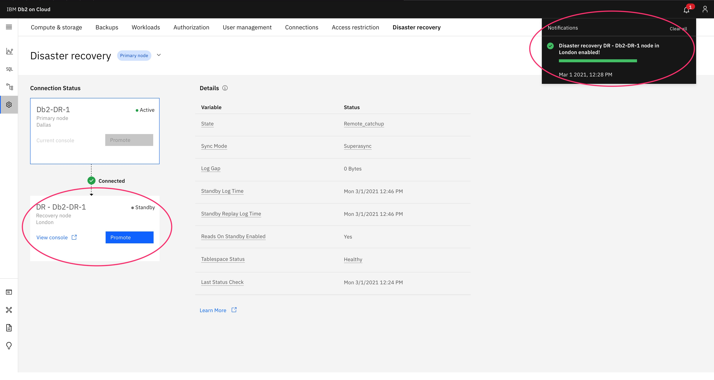

---

copyright:
  years: 2014, 2025
lastupdated: "2025-03-20"

keywords: DR, HADR, disaster recovery, Enterprise, Standard, Db2 on Cloud, failover, failback

subcollection: Db2onCloud

---

 
{:external: target="_blank" .external}
{:shortdesc: .shortdesc}
{:codeblock: .codeblock}
{:screen: .screen}
{:tip: .tip}
{:important: .important}
{:note: .note}
{:deprecated: .deprecated}
{:pre: .pre}
{:video: .video}

# Geo-replicated disaster recovery (DR)
{: #dr_gen}

{{site.data.keyword.Db2_on_Cloud_short}} leverages Db2 HADR technology and gives you the ability to add a DR node, on demand, in an offsite data center of your choice. In an unlikely event that the primary data server is affected by external circumstances such as a natural disaster, you can failover to your Geo-Replicated Disaster Recovery node with a few clicks. You can also fail back to your primary site just as easily.
{: shortdesc}

Admin functionality is not available on the DR node. Any admin functions must be run on the primary instance while it's **Active**.
{: important}

DR nodes are currently set up to adopt the KMS instance and disk encrption key of the primary data server in the case that the primary data server uses Hyper Protect Crypto Services for encryption.
{: important}

DR nodes are currently available for only Enterprise and Standard HADR plans. DR nodes are currently not supported in single node plans or in EU-Cloud.
{: important}

Failover to the DR site is not automatic. You must initiate the failover.
{: important}
 
[Creating a DR node](#dr_create_dr_node)

[Deleting a DR node](#dr_delete_dr_node)

[Forcing a failover to the DR site](#dr_force_failover)

[Forcing a failback to the primary site](#dr_force_failback)

## High Availability vs. Disaster Recovery
{: #dr_ha_vs_dr}

{{site.data.keyword.Db2_on_Cloud_short}} High Availability plan offers Db2 HADR SYNC and ASYNC nodes technology to deliver superior availability and reliability, within the same region. When required, failover to the HA nodes is managed seamlessly and automatically by IBM using automatic client reroute (ACR). HA plans reside within a single MZR or SZR region.

With the introduction of Geo-Replicated Disaster Recovery nodes, you are now able to extend that availability to an entirely different region by adding an on-demand Disaster Recovery node. This ability ensures that you can still access your data in the unlikely event of an outage in your primary region. For example, primary instance: Dallas; DR node: London.

## Enterprise and Standard HADR plans
{: #dr_ent_std_plans}

DR nodes are now available for Enterprise and Standard HADR plans only. DR nodes are currently not supported in single node plans or in EU-Cloud.  

### Creating a DR node
{: #dr_create_dr_node}

1. Select **Administration** from the left menu, then select the **Disaster recovery** tab.
   {: caption="Figure 1. View of the DR page" caption-side="bottom"}

2. Select a data center for the DR node and click **Enable disaster recovery**.
   {: caption="Figure 2. Select a data center for the recovery node" caption-side="bottom"}

3. The new DR node is displayed on the **Disaster recovery** page along with a notification indicating a successful deployment.
   {: caption="Figure 3. Recovery node sucessfully created" caption-side="bottom"}

### Deleting a DR node
{: #dr_delete_dr_node}

Deleting a DR service instance removes only the DR node, leaving the HA instance intact. Once deleted, you can re-deploy a DR node in any designated location from the HA setup.

The DR node must be in a standby state before you can delete it. If it is not in standby, you must initiate a failback to the primary site. {: important}

### Forcing a failover to the DR site
{: #dr_force_failover}

1. To force a failover to the DR site, open the web console for the recovery site from the {{site.data.keyword.cloud_notm}} dashboard. 
   {: caption="Figure 4. Recovery node console" caption-side="bottom"}

2. To initiate a takeover, click **Promote** on the **Disaster recovery** page.
   {: caption="Figure 5. Recovery node takeover" caption-side="bottom"}

3. Click **Promote** to confirm takeover.
   {: caption="Figure 6. Takeover confirmation" caption-side="bottom"}

4. Takeover can take up to 30 minutes, depending on the size of the database.
   {: caption="Figure 7. Takeover progress bar" caption-side="bottom"}

5. A successful takeover by the recovery node is indicated by the **Promotion** button moving to the primary node (now the standby) along with a notification. The recovery site is now **Active**.
   {: caption="Figure 8. Takeover completion" caption-side="bottom"}

### Forcing a failback to the primary site
{: #dr_force_failback}

1. To force a failback to the primary site, open the web console for the primary site from the {{site.data.keyword.cloud_notm}} dashboard.
   {: caption="Figure 9. Primary node console" caption-side="bottom"}

2. To initiate a takeover, click **Promote** on the **Disaster recovery** page. The takeover confirmation screen appears. Click **Promote** on the takeover confirmation screen to initiate the takeover.
   {: caption="Figure 10. Priamry node takeover" caption-side="bottom"}

3. The takeover can take up to 30 minutes, depending on the size of the database.
   {: caption="Figure 11. Takeover progress bar" caption-side="bottom"}

4. A successful takeover by the primary node is indicated by the **Promotion** button moving to the recovery node (now the standby) along with a notification. The primary site is now **Active**.
   {: caption="Figure 12. Takeover completion" caption-side="bottom"}

