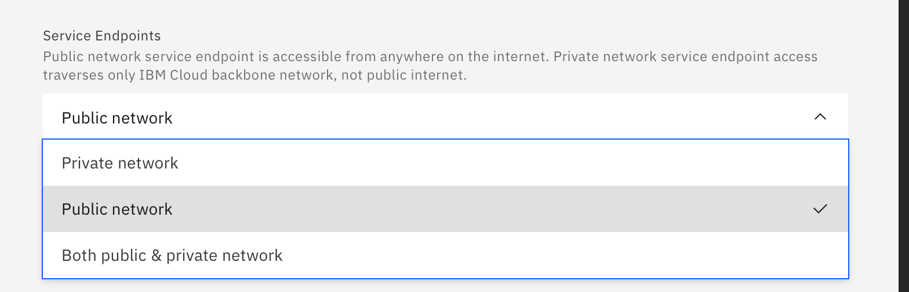

---

copyright:
  years: 2014, 2020
lastupdated: "2020-10-20"

keywords: 

subcollection: Db2onCloud

---

 
{:external: target="_blank" .external}
{:shortdesc: .shortdesc}
{:codeblock: .codeblock}
{:screen: .screen}
{:tip: .tip}
{:important: .important}
{:note: .note}
{:deprecated: .deprecated}
{:pre: .pre}

# Endpoints
{: #endpts}

## Standard and Enterprise plans
{: #ep_plans}

The Standard and Enterprise plans offer the choice of Public, Private, or both Public and Private endpoints.

- Public network service endpoint is accessible from anywhere on the internet. 
- Private network service endpoint access traverses only the {{site.data.keyword.cloud_notm}} backbone network, not the public internet.

### Instance creation
{: ep_inst_create}

At the time of instance creation, you can select your choice of endpoint from the **Service Endpoints** box on {{site.data.keyword.cloud_notm}}.

{: caption="Endpoint choice at instance creation" caption-side="bottom"}

### Changing endpoints after creation
{: #ep_chg_epts_after_creation}

You can change endpoints at any time after creating an instance of a Standard or Enterprise plan.

To change endpoints, complete the following steps:
- Select your Db2 service from {{site.data.keyword.cloud_notm}}.
- From the **Manage** tab, click **Open Console**.
- Select **Administration** from the left side menu.
- Select the **Access restriction** tab.
- Select either **Public endpoints**, **Private endpoints**, or **Public-and-private endpoints**.
- Click **Update**. The change occurs immediately.

{: caption="Change endpoint after instance creation" caption-side="bottom"}

### View endpoints
{: #ep_view_endpoints}

To view your endpoints:
- Select your Db2 service from {{site.data.keyword.cloud_notm}}.
- From the **Manage** tab, click **Open Console**.
- Select **Administration** from the left side menu.
- Select the **Connections** tab. Endpoint information will be displayed in **Connection configuration resources**.

{: caption="Viewing endpoint information" caption-side="bottom"}
