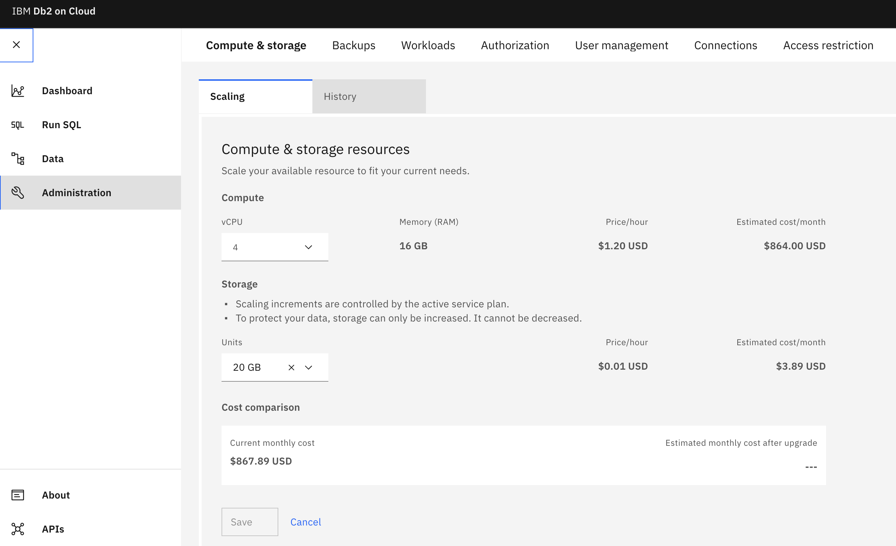
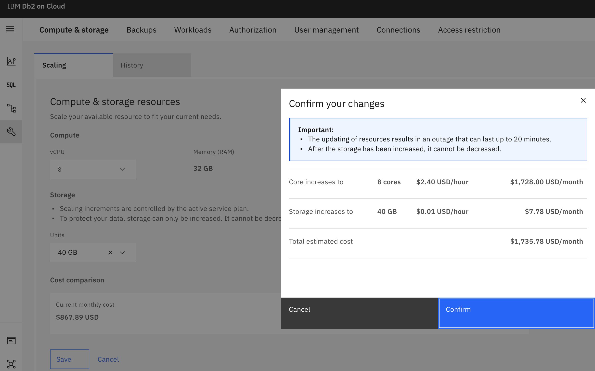
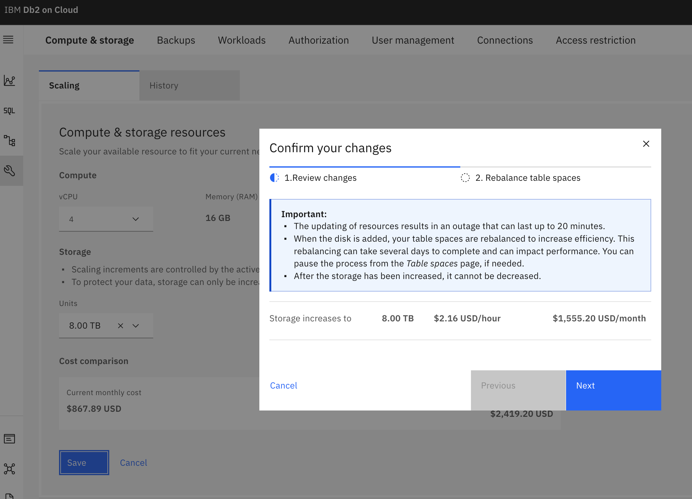
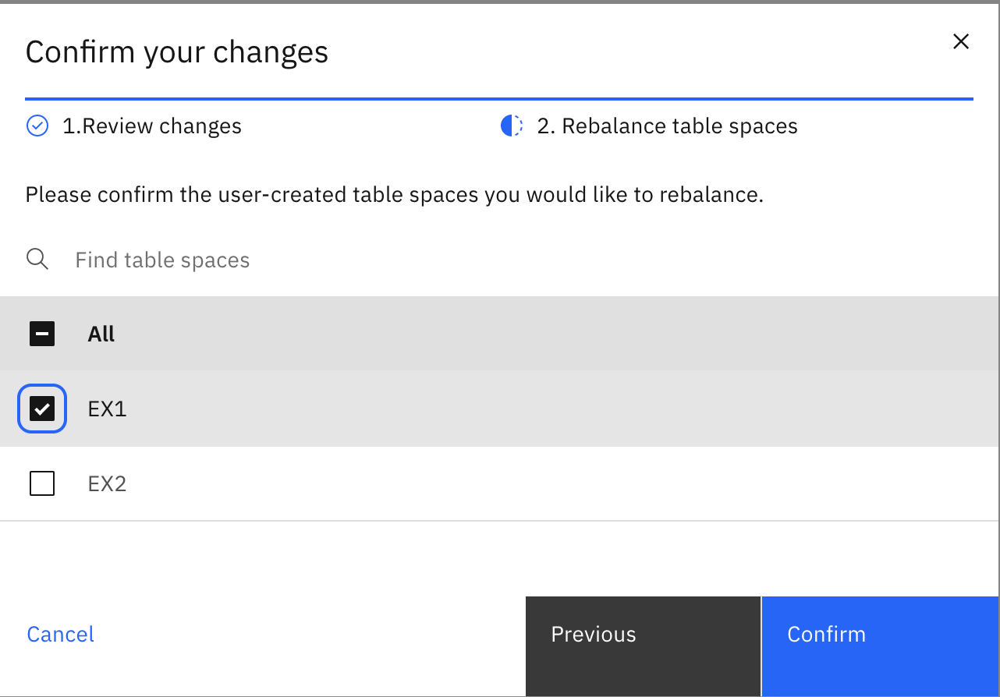
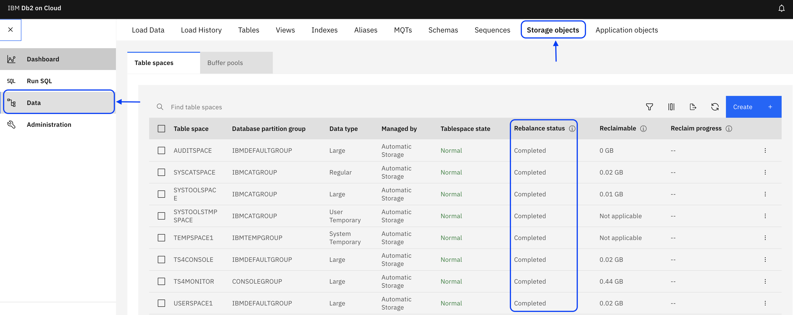
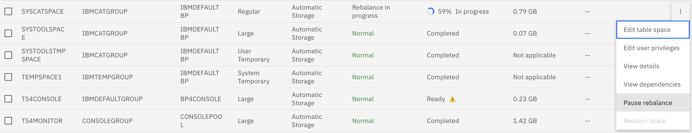
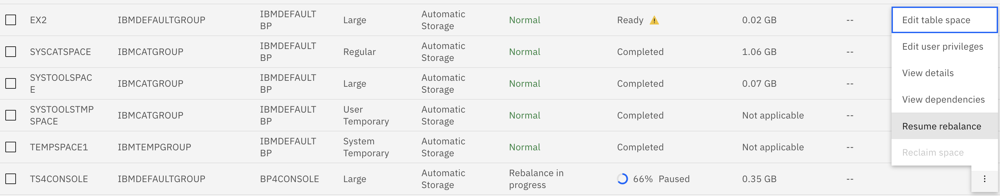
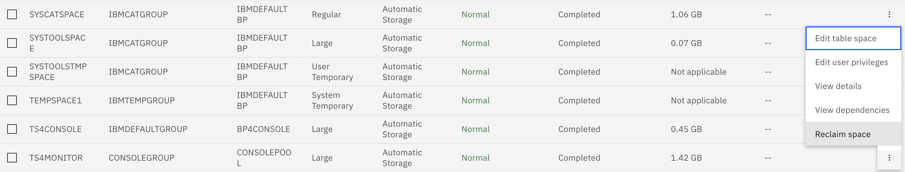

---

copyright:
  years: 2014, 2022
lastupdated: "2022-11-28"

keywords: 

subcollection: Db2onCloud

---

<!-- Attribute definitions --> 
{:external: target="_blank" .external}
{:shortdesc: .shortdesc}
{:codeblock: .codeblock}
{:screen: .screen}
{:tip: .tip}
{:important: .important}
{:note: .note}
{:deprecated: .deprecated}
{:pre: .pre}

# Flexible scaling
{: #scale}

Db2 on Cloud provides you with the ability to independently scale up compute cores and storage. 
{: shortdesc}

As the number of cores is increased, memory is also increased.
{: important}

Storage cannot be scaled down after it has been increased.
{: important}

## Standard plan
{: #fs_standard_plan}

The Standard plan deploys with 8 GB of RAM, and 20 GB of disk space. You can then scale your plan with the drop-down lists in the {{site.data.keyword.Db2_on_Cloud_short}} console.

Dedicated cores can be scaled up or down in the following increments with memory changing accordingly:

| Cores | Memory |
|-------|--------|
| 2     |  8 GB  |
| 4     | 16 GB  |
| 8     | 32 GB  |
| 16    | 64 GB  |
{: caption="Table 1. Core/memory scaling increments" caption-side="top"}

Storage can be scaled up to a maximum of 4 TB.

To scale memory and storage from within the console, complete the following steps:
1. Select **Administration** from the left side menu.
2. Select the **Compute & storage** tab.
3. Select **Edit** under the **Compute & storage resources**.
4. Select the drop-down list for **vCPU** (for memory) or **Units** for storage to make changes.
5. Click **Save**.
6. Select **Confirm** if you are satisfied with the changes.

{: caption="Figure 1. Standard plan scaling memory and storage" caption-side="bottom"}

{: caption="Figure 2. Confirm scaling changes for standard plan" caption-side="bottom"}

## Enterprise plan
{: #fs_enterprise_plan}

Your Enterprise plan initially deploys with 4 cores, 16 GB of RAM, and 20 GB of disk space. You can then scale your plan with the drop-down lists in the {{site.data.keyword.Db2_on_Cloud_short}} console.

Dedicated cores can be scaled up or down in the following increments with memory changing accordingly:

| Cores | Memory |
|-------|--------|
| 4     | 16 GB  |
| 8     | 32 GB  |
| 16    | 64 GB  |
| 32    | 128 GB |
| 56    | 242 GB |
{: caption="Table 2. Core/memory scaling increments" caption-side="top"}

When Storage is below 4 TB, it is scaled up in increments of 20 GB. When storage exceeds 4 TB, it will implement multiple disks. Each disk contains 4 TB storage; thus, in total, storage can be scaled up in increments of 4 TB as shown in the following example:
-  8 TB
- 12 TB
- 16 TB
- 20 TB
- 24 TB

Storage can be scaled up to a maximum of 24 TB.

To scale cores/memory and storage from within the console, complete the following steps:
1. Select **Administration** from the left side menu.
2. Select the **Compute & storage** tab.
3. Select **Edit** under the **Compute & storage resources**.
4. Select the drop-down list for **vCPU** (for memory) or **Units** for storage to make changes.
5. Click **Save**.
6. Select **Confirm** if you are satisfied with the changes.

{: caption="Figure 3. Enterprise plan scaling cores/memory and storage" caption-side="bottom"}

{: caption="Figure 4. Confirm scaling changes for enterprise plan" caption-side="bottom"}

### Scaling disk storage more than 4 TB
{: #disk_st_4tb}

There may be an outage when tablespaces under the default storage group are rebalanced.
{: important}

Rebalancing tablespaces can take several days to complete and can impact your performance.
{: important}

Two new functions, `Rebalance` and `Free space reclamation`, are introduced to maximize the benefits of having multiple disks once you scale past 4TB.

{: caption="Figure 5. Confirm scaling changes for enterprise plan" caption-side="bottom"}

#### Rebalance
{: #rebalance}

The `Rebalance` functionality enables redistributing data which brings with it the benefit of striping data across multiple disks. When scaling storage past 4TB, tablespaces under the default storage group IBMSTOGROUP will be automatically rebalanced.

You are now given the option to rebalance any tablespaces from non-default storage groups after scaling is completed.  A pop-up window will be presented to confirm rebalancing.

It is highly recommended to rebalance non-default storage groups after scaling past 4TB.
{: important}

{: caption="Figure 6. Confirm rebalance on tablespaces before scaling" caption-side="bottom"}

#### Rebalance Status

To View the Rebalance status of tablespaces:
- Select **Data** from Left Side
- Click on the **storage objects** tab on top. 

You can rebalance a tablespace individually on this tab.

{: caption="Figure 7. View rebalance status of tablespaces" caption-side="bottom"}

Rebalance may impact your workload performance. Pause rebalance temporarily and resume it during an off-peak period if the rebalance affects your workload performance.
{: important}

{: caption="Figure 8. Pause rebalance" caption-side="bottom"}

{: caption="Figure 9. Resume rebalance" caption-side="bottom"}

#### Free space reclamation after rebalance
{: #reclamation}

Reclaim freed space on disks after rebalancing by choosing the Reclaim space option as shown in the figure below. After the space is reclaimed, the reclaimable space will be updated to **0 GB** in the **reclaimable** column.

{: caption="Figure 10. Reclaim freed disk space" caption-side="bottom"}

{: caption="Figure 11. Freed disk space reclaimed" caption-side="bottom"}

<!--These dynamic adjustments typically take less than 20 minutes to complete. You can also scale CPU and RAM without any downtime by following these [guidelines](https://developer.ibm.com/answers/questions/381931/how-can-i-scale-cpu-up-and-down-without-downtime-o.html){:external}.-->

<!--
## Legacy plans
{: #fs_legacy_plans}

Independent scaling of RAM, storage, and compute cores. 

Your Flex plan initially deploys with 1 core, 4 GB of RAM and 2 GB of disk space. You can then scale your plan up or down with slider bars.

These dynamic adjustments typically take less than 20 minutes to complete. You can even scale CPU and RAM without any downtime by following these [guidelines](https://developer.ibm.com/answers/questions/381931/how-can-i-scale-cpu-up-and-down-without-downtime-o.html){:external}.
-->
