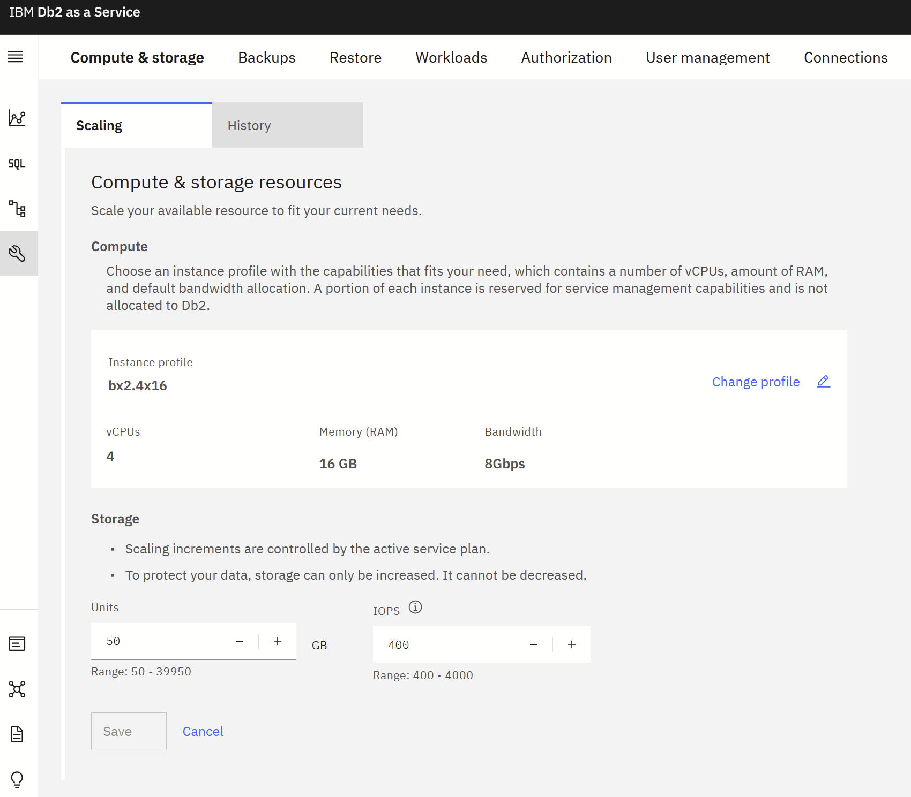

---

copyright:
  years: 2014, 2025
lastupdated: "2025-04-20"

keywords:

subcollection: Db2onCloud

---

{:external: target="_blank" .external}
{:shortdesc: .shortdesc}
{:codeblock: .codeblock}
{:screen: .screen}
{:tip: .tip}
{:important: .important}
{:note: .note}
{:deprecated: .deprecated}
{:pre: .pre}

# Flexible scaling
{: #scale}

{{site.data.keyword.Db2_on_Cloud_long}}  provides you with the ability to independently scale up compute cores and storage.
{: shortdesc}

As the number of cores is increased, memory is also increased.  The updating of resources can result in an outage that can last up to 20 minutes.
{: important}

Storage cannot be scaled down once it has been increased.
{: important}

## Standard plan
{: #fs_standard_plan}

The Standard plan deploys with 8 GB of RAM, and 20 GB of disk space. You can then scale your plan with the drop-down lists in the {{site.data.keyword.Db2_on_Cloud_short}} console.

Memory can be scaled up or down by selecting the number of vCPU.  The standard plan is a multitenaned plan and therefore has dedicated memory only.

Memory can be scaled in the following increments:

| vCPU  | Memory |
|-------|--------|
| 2     |  8 GB  |
| 4     | 16 GB  |
| 8     | 32 GB  |
| 16    | 64 GB  |
{: caption="Core/memory scaling increments" caption-side="top"}

Storage can be scaled up to a maximum of 4 TB.

To scale memory and storage from within the console, complete the following steps:
1. Select **Administration** from the left side menu.
2. Select the **Compute & storage** tab.
3. Select **Edit** under the **Compute & storage resources**.
4. Select the drop-down list for **vCPU** (for memory) or **Units** for storage to make changes.
5. Click **Save**.
6. Select **Confirm** if you are satisfied with the changes.

{: caption="Standard plan scaling memory and storage" caption-side="bottom"}

{: caption="Confirm scaling changes for standard plan" caption-side="bottom"}

## Enterprise plan
{: #fs_enterprise_plan}

Your Enterprise plan initially deploys with 4 cores, 16 GB of RAM, and 20 GB of disk space. You can then scale your plan with the drop-down lists in the {{site.data.keyword.Db2_on_Cloud_short}} console.

Dedicated cores can be scaled up or down in the following increments with memory changing accordingly:

| Cores | Memory |
|-------|--------|
| 4     | 16 GB  |
| 8     | 32 GB  |
| 16    | 64 GB  |
| 32    | 128 GB |
| 56    | 242 GB |
{: caption="Core/memory scaling increments" caption-side="top"}

When Storage is below 4 TB, it is scaled up in increments of 20 GB. When storage exceeds 4 TB, it will implement multiple disks. Each disk contains 4 TB storage; thus, in total, storage can be scaled up in increments of 4 TB as shown in the following example:
-  8 TB
- 12 TB
- 16 TB
- 20 TB
- 24 TB

Storage can be scaled up to a maximum of 24 TB.

To scale cores/memory and storage from within the console, complete the following steps:
1. Select **Administration** from the left side menu.
2. Select the **Compute & storage** tab.
3. Select **Edit** under the **Compute & storage resources**.
4. Select the drop-down list for **vCPU** (for memory) or **Units** for storage to make changes.
5. Click **Save**.
6. Select **Confirm** if you are satisfied with the changes.

{: caption="Enterprise plan scaling cores/memory and storage" caption-side="bottom"}

{: caption="Confirm scaling changes for enterprise plan" caption-side="bottom"}

### Scaling disk storage more than 4 TB
{: #disk_st_4tb}

There may be an outage when tablespaces under the default storage group are rebalanced.
{: important}

Rebalancing tablespaces can take several days to complete and can impact your performance.
{: important}

Two new functions, `Rebalance` and `Free space reclamation`, are introduced to maximize the benefits of having multiple disks once you scale past 4TB.

{: caption="Confirm scaling changes for enterprise plan" caption-side="bottom"}

#### Rebalance
{: #rebalance}

The `Rebalance` functionality enables redistributing data which brings with it the benefit of striping data across multiple disks. When scaling storage past 4TB, tablespaces under the default storage group IBMSTOGROUP will be automatically rebalanced.

You are now given the option to rebalance any tablespaces from non-default storage groups after scaling is completed.  A pop-up window will be presented to confirm rebalancing.

It is highly recommended to rebalance non-default storage groups after scaling past 4TB.
{: important}

{: caption="Confirm rebalance on tablespaces before scaling" caption-side="bottom"}

#### Rebalance Status

To View the Rebalance status of tablespaces:
- Select **Data** from Left Side
- Click on the **storage objects** tab on top.

You can rebalance a tablespace individually on this tab.

{: caption="View rebalance status of tablespaces" caption-side="bottom"}

Rebalance may impact your workload performance. Pause rebalance temporarily and resume it during an off-peak period if the rebalance affects your workload performance.
{: important}

{: caption="Pause rebalance" caption-side="bottom"}

{: caption="Resume rebalance" caption-side="bottom"}

#### Free space reclamation after rebalance
{: #reclamation}

Reclaim freed space on disks after rebalancing by choosing the Reclaim space option as shown in the figure below. After the space is reclaimed, the reclaimable space will be updated to **0 GB** in the **reclaimable** column.

{: caption="Reclaim freed disk space" caption-side="bottom"}

{: caption="Freed disk space reclaimed" caption-side="bottom"}

## Perfomance Plan
{: #fs_perfomance_plan}

Each Db2 on Cloud Performance Plan instance deploys with 50 GB of disk space and 400 IOPS by default. Storage can be scaled up to a maximum of 39,950 GB in increments of 20 GB starting at 50 GB, while IOPS can be scaled up to a maximum of 192,000 in increments of 100.

The following table shows the available IOPS ranges based on storage capacity.
{: shortdesc}

| Total Size (GB) |          | Total IOPS |          |
|-----------------|----------|------------|----------|
| min             | max      | min        | max      |
| 50              | 150      | 400        | 4,000    |
| 170             | 310      | 400        | 8,000    |
| 330             | 390      | 400        | 16,000   |
| 410             | 1,990    | 400        | 24,000   |
| 2,010           | 3,990    | 400        | 40,000   |
| 4,010           | 7,990    | 800        | 80,000   |
| 8,010           | 31,990   | 2,000      | 160,000  |
| 32,010          | 39,950   | 2,000      | 192,000  |
{: caption="Storage/IOPS scaling ranges" caption-side="top"}

## Scaling Storage from the Console

To scale storage from within the console, complete the following steps:

1. Select **Administration** from the left side menu.
2. Select the **Compute & storage** tab.
3. Select **Edit** under the Compute & storage resources.
4. Select the desired **Units** for storage and IOPS to make changes.
5. Click **Save**.
6. Select **Confirm** if you are satisfied with the changes.

{: caption="Perfomance Plan memory and storage" caption-side="bottom"}

> **Note:** In this documentation, we refer to storage capacity using the unit **GB (Gigabytes)** to align with industry standard terminology. However, the actual provisioning and billing of storage are based on **GiB (Gibibytes)**.

### GB vs GiB

- **GB (Gigabyte)** is a decimal unit, where
  **1 GB = 1,000,000,000 bytes**
- **GiB (Gibibyte)** is a binary unit, where
  **1 GiB = 1,073,741,824 bytes**
