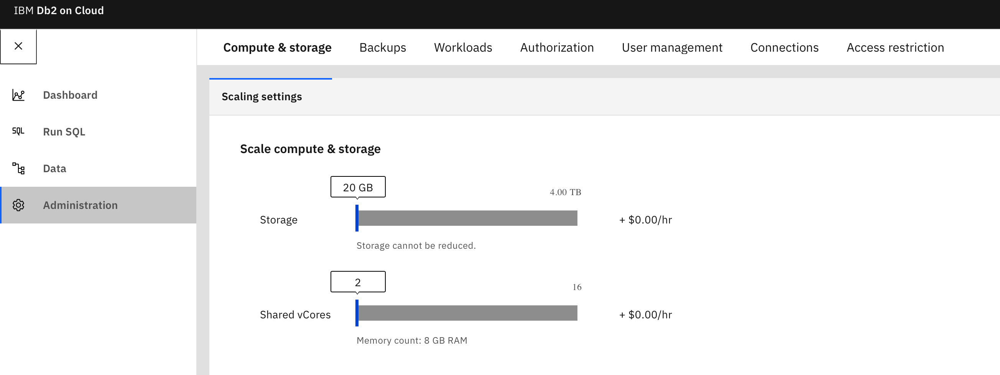

---

copyright:
  years: 2014, 2021
lastupdated: "2021-01-19"

keywords: 

subcollection: Db2onCloud

---

<!-- Attribute definitions --> 
{:external: target="_blank" .external}
{:shortdesc: .shortdesc}
{:codeblock: .codeblock}
{:screen: .screen}
{:tip: .tip}
{:important: .important}
{:note: .note}
{:deprecated: .deprecated}
{:pre: .pre}

# Flexible scaling
{: #scale}

Independent scaling of storage and compute cores. 
{: shortdesc}

As the number of cores is increased, memory is also increased.
{: important}

Storage cannot be scaled down after it has been increased.
{: important}

## Standard plan
{: #fs_standard_plan}

The Standard plan deploys with 8 GB of RAM, and 20 GB of disk space. You can then scale your plan up or down with the slider bars in the console. 

Memory can be scaled up or down in the following increments:
- 8 GB
- 16 GB
- 32 GB
- 64 GB

Storage can be scaled up to a maximum of 4 TB. After scaling up, storage cannot be scaled down.

To scale memory and storage from within the console, complete the following steps:
1. Select **Administration** from the left side menu.
2. Select the **Compute & storage** tab.
3. Slide the **Shared vCores** (for memory) or **Storage** slider bar to make changes.
4. Click **Save**.

{: caption="Figure 1. Standard plan scaling memory and storage" caption-side="bottom"}

## Enterprise plan
{: #fs_enterprise_plan}

Your Enterprise plan initially deploys with 4 cores, 16 GB of RAM, and 20 GB of disk space. You can then scale your plan up or down with slider bars in the {{site.data.keyword.Db2_on_Cloud_short}} console by up to 56 virtual cores and 4 TB of storage. 

Dedicated cores can be scaled up or down in the following increments with memory changing accordingly:

| Cores | Memory |
|-------|--------|
| 4     | 16 GB  |
| 8     | 32 GB  |
| 16    | 64 GB  |
| 32    | 126 GB |
| 56    | 242 GB |
{: caption="Table 1. Core/memory scaling increments" caption-side="top"}

Storage can be scaled up to a maximum of 4 TB. After scaling up, storage cannot be scaled down.

To scale cores/memory and storage from within the console, complete the following steps:
1. Select **Administration** from the left side menu.
2. Select the **Compute & storage** tab.
3. Slide the **Dedicated vCores** or **Storage** slider bar to make changes.
4. Click **Save**.

{: caption="Figure 2. Enterprise plan scaling cores/memory and storage" caption-side="bottom"}

<!--These dynamic adjustments typically take less than 20 minutes to complete. You can also scale CPU and RAM without any downtime by following these [guidelines](https://developer.ibm.com/answers/questions/381931/how-can-i-scale-cpu-up-and-down-without-downtime-o.html){:external}.-->

<!--
## Legacy plans
{: #fs_legacy_plans}

Independent scaling of RAM, storage, and compute cores. 

Your Flex plan initially deploys with 1 core, 4 GB of RAM and 2 GB of disk space. You can then scale your plan up or down with slider bars.

These dynamic adjustments typically take less than 20 minutes to complete. You can even scale CPU and RAM without any downtime by following these [guidelines](https://developer.ibm.com/answers/questions/381931/how-can-i-scale-cpu-up-and-down-without-downtime-o.html){:external}.
-->
