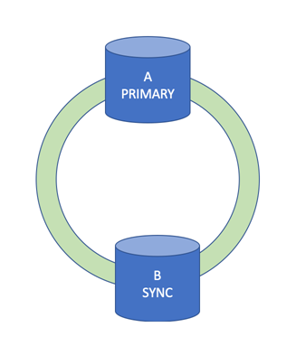
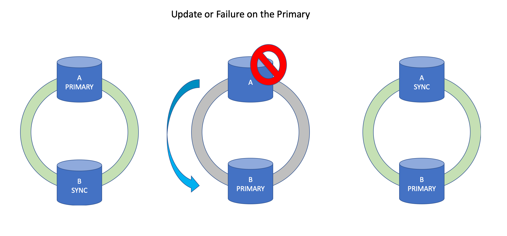

---

copyright:
  years: 2014, 2021, 2022
lastupdated: "2023-08-17"

keywords: HADR, Legacy Flex, legacy, Flex, high availability disaster recovery

subcollection: Db2onCloud

---

<!-- Attribute definitions --> 
{:external: target="_blank" .external}
{:shortdesc: .shortdesc}
{:codeblock: .codeblock}
{:screen: .screen}
{:tip: .tip}
{:important: .important}
{:note: .note}
{:deprecated: .deprecated}
{:pre: .pre}

The **blocknonlogged** parameter must always be set to **YES**.  Changing it to NO will cause any non logged transactions on the primary database to fail to be replicated to the standby databases thereby making the data inconsistent in the HADR environment. {: important}

# High availability (HA)
{: #ha}

{{site.data.keyword.Db2_on_Cloud_short}} high availability plans have excellent availability characteristics with a 99.99% SLA. 
{: shortdesc}

<!--
## Standard and Enterprise plans
{: #ha_v2_ha}
-->

High availability disaster recovery (HADR) on {{site.data.keyword.Db2_on_Cloud_short}} Enterprise and Standard plans is provided by leveraging the support of native Db2 HADR. 

- Each HADR system consists of 3 nodes located in different independent availability zones.  

{: caption="Figure 1. Schematic view of the 3 nodes in different availability zones" caption-side="bottom"}

- The primary node processes read and write transactions and the standby nodes can provide read-only query capability. One of the standby nodes is replicated synchronously, which means each transaction is committed on at least 2 nodes before it is successful. This standby node is ready to take over write processing as well should any failure or maintenance event occur. The other standby node is asynchronously replicated and assumes the role of the synchronous node during a failure or maintenance event. Even in the case of an entire data center failure or maintenance event, you still have an HA system that is replicated between the surviving data centers.

{: caption="Figure 2. Schematic view of primary node failover" caption-side="bottom"}

- During failover events, you can expect between 10-20 seconds during which transactions are restricted. Your client can seamlessly fail over by using [automatic client reroute (ACR)](https://www.ibm.com/support/knowledgecenter/SSEPGG_11.5.0/com.ibm.db2.luw.admin.ha.doc/doc/r0023392.html){: external} along with appropriate retry logic for any failed transactions.

### Managing HADR nodes
{: #ha_v2_manage}

For Enterprise and Standard HADR plans, the failover is managed for you by IBM. IBM monitors the health of your server, fail over and fail back as needed, including rolling updates and scaling to keep uptime as high as possible.

<!--
## Legacy Flex plans
{: #ha_legacy}

High availability on {{site.data.keyword.Db2_on_Cloud_short}} Legacy Flex plans is provided by leveraging the support of native Db2 HADR.

- Each HA system consists of 2 nodes. 

{: caption="Figure 1. Schematic view of the 2 nodes" caption-side="bottom"}

- The primary node processes read and write transactions while the standby node is replicated synchronously, which means each transaction is committed on at least 2 nodes before it is successful. This standby node is ready to take over write processing as well should any failure or maintenance event occur. 

{: caption="Figure 2. Schematic view of primary node failover" caption-side="bottom"}

The standard high availability plans without a disaster recovery (DR) node provide seamless failover and rolling updates. They are managed for you by using [automatic client reroute (ACR)](https://www.ibm.com/support/knowledgecenter/SSEPGG_11.5.0/com.ibm.db2.luw.admin.ha.doc/doc/r0023392.html){: external} and portable IPs.

### Managing high availability nodes
{: #ha_manage}

For standard HA nodes, which are not offsite, the failover is managed for you by IBM. IBM monitors the health of your server, fail over and fail back as needed, including rolling updates and scaling to keep uptime as high as possible.
-->

