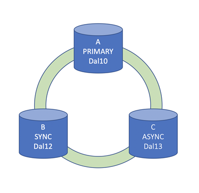
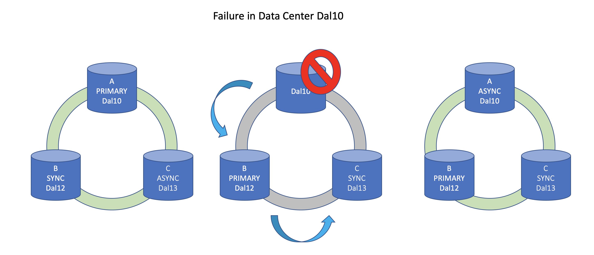

---

copyright:
  years: 2014, 2020
lastupdated: "2020-08-28"

keywords: 

subcollection: Db2onCloud

---

<!-- Attribute definitions --> 
{:external: target="_blank" .external}
{:shortdesc: .shortdesc}
{:codeblock: .codeblock}
{:screen: .screen}
{:tip: .tip}
{:important: .important}
{:note: .note}
{:deprecated: .deprecated}
{:pre: .pre}
{:video: .video}

# High availability (HA) of Db2 on Cloud V2
{: #ha_v2}

{{site.data.keyword.Db2_on_Cloud_short}} V2 HA plans have excellent availability characteristics with a 99.99% SLA.
{: shortdesc}

## High availability
{: #ha_ha}

High availability on {{site.data.keyword.Db2_on_Cloud_short}} V2 is provided by leveraging the support of native Db2 HADR. 

- Each HA system consists of 3 nodes located in different independent availability zones.  

{: caption="Figure 1. Schematic view of the 3 nodes in different availability zones" caption-side="bottom"}

- The primary node processes read and write transactions and the standby nodes can provide read-only query capability. One of the standby nodes is replicated synchronously, which means each transaction is committed on at least 2 nodes before it is successful. This standby node is ready to take over write processing as well should any failure or maintenance event occur. The other standby node is asynchronously replicated and assumes the role of the synchronous node during a failure or maintenance event. Even in the case of an entire data center failure or maintenance event, you still have an HA system that is replicated between the surviving data centers.

{: caption="Figure 2. Schematic view of primary node failover" caption-side="bottom"}

- During failover events, you can expect between 10-20 seconds during which transactions are restricted. Your client can seamlessly fail over by using [automatic client reroute (ACR)](https://www.ibm.com/support/knowledgecenter/SSEPGG_11.5.0/com.ibm.db2.luw.admin.ha.doc/doc/r0023392.html){: external} along with appropriate retry logic for any failed transactions.

## Managing high availability
{: #ha_manage}

For standard HA nodes, which are not offsite, the failover is managed for you by IBM. IBM monitors the health of your server, fail over as needed, including rolling updates and scaling, to keep uptime as high as possible.

