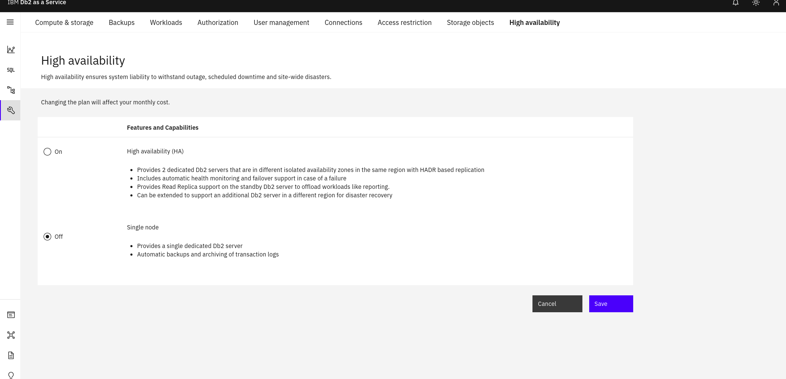

---

copyright:
  years: 2024
lastupdated: "2024-12-14"

keywords: HADR, high availability disaster recovery, performance

subcollection: Db2onCloud

---

<!-- Attribute definitions --> 
{:external: target="_blank" .external}
{:shortdesc: .shortdesc}
{:codeblock: .codeblock}
{:screen: .screen}
{:tip: .tip}
{:important: .important}
{:note: .note}
{:deprecated: .deprecated}
{:pre: .pre}

# HADR Conversion

With {{site.data.keyword.Db2_on_Cloud_short}} Performance plans, administrators can change their high availability configuration. Administrator's can convert their {{site.data.keyword.Db2_on_Cloud_short}} instance from high availability, to a single node instance and vice versa.

## Considerations
- Downtime during any maintenance will increase as rolling updates/maintenance cannot be performed if going from a high available instance to single node instance.
- If you are configuring from high availability to single, note that there will be bit of downtime at the end of the configuration to restart the orchestrator to recognize the availability configuration has changed.
- When scaling from a single-node setup to a high-availability configuration, expect a brief connection interruption as the orchestrator restarts to integrate the newly added pod. 
- Deployments which have a Disaster Recovery configured can not switch to single node without unconfiguring the diasaster recovery settings.

## ****Configuring Availability in the UI****

The High Availability panel is on the Adminstration tab of your deployment's console page.

You can choose the desired availability and click **Save**.




## ****Configuring High Availability using the API**** 

If you would like to change the configuration on your deployment through the API, you can send a `PATCH` request to the following endpoint

```bash
curl -X PATCH https://api.{region}.databases.cloud.ibm.com/v6/ibm/deployments/{guid}/availability \
-H 'Authorization: Bearer <token>' \
-H 'Content-Type: application/json' \
-d '{"availability": "<availability-option>"}'
```

- availability-option - can be either `high` or `single`. `high` will attempt to send a request to scale a single node instance to a high available instance, while `single` does the opposite.