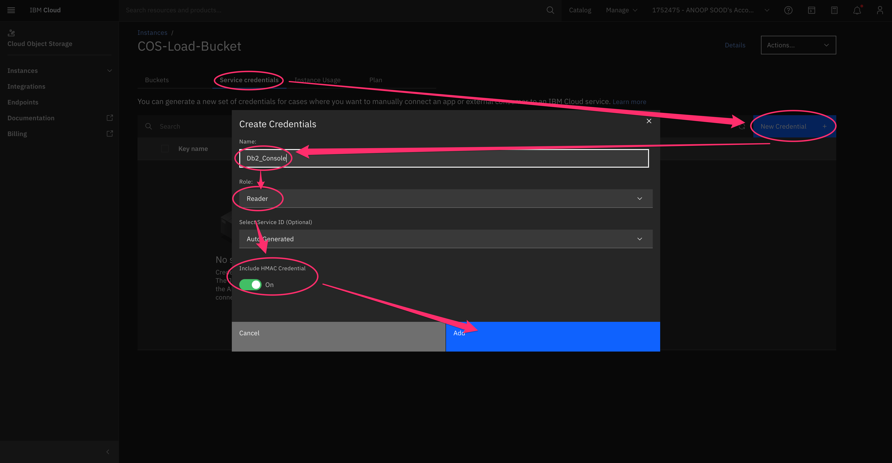

---

copyright:
  years: 2014, 2023
lastupdated: "2023-07-12"

keywords: 

subcollection: Db2onCloud

---

<!-- Attribute definitions --> 
{:external: target="_blank" .external}
{:shortdesc: .shortdesc}
{:codeblock: .codeblock}
{:screen: .screen}
{:tip: .tip}
{:important: .important}
{:note: .note}
{:deprecated: .deprecated}
{:pre: .pre}


# Loading data from IBM Cloud Object Storage
{: #loading}

## Using Console
{: #console}

You can load data from IBM Cloud Object Storage (COS) into IBM® Db2® on Cloud by using the Console.

### Create the necessary credentials on the COS bucket to allow Console to access the data
{: #bucket}

1. Access the COS Bucket on the IBMCloud Dashboard by clicking on the name

{: caption="Figure 1. Resource List" caption-side="bottom"}

### Create Credentials on the COS bucket so Db2 Console can access the data.

1. Select `Service Credentials`
2. Click on `New Credentials`
3. Enter `Name` for the Service Credential
4. Select the appropriate role
5. Ensure `Include HMAC Credential` is enabled


 {: caption="Figure 2. Create Service Credentials" caption-side="bottom"}

  

### Get the `Access key` and `Secret access key` from the Credentials 

1. Expand the Credential
2. Note down the `access_key_id` and `secret_access_key`


{: caption="Figure 3. Get Access Keys" caption-side="bottom"}

  

### Open the Db2 Console to the load data page

1. Click on `Data` on the left menu
2. Click on `Load Data` on the top tab
3. Click on `Cloud Object Storage`
4. Pick the `COS Authentication Endpoint` that matches your bucket
5. Enter the `access_key_id` from above for `Access key`
6. Enter the `secret_access_key` from above for `Secret access key`
7. Click on `Browse Files` to select the file you want to load from

{: caption="Figure 4. Load COS Data" caption-side="bottom"}

## External Tables
{: #external}

You can load data from IBM Cloud Object Storage (COS) into IBM® Db2® on Cloud by using the built-in External Tables functionality.


Here's an example SQL statement that inserts COS data into a {{site.data.keyword.dashdbshort_notm}} table by using External Tables:

```
INSERT INTO <table-name> SELECT * FROM EXTERNAL '<mys3file.txt>' USING
  (CCSID 1208 s3('s3-api.us-geo.objectstorage.softlayer.net',
  '<S3-access-key-ID>',
  '<S3-secret-access-key>',
  '<my_bucket>'
     )
  )
```


