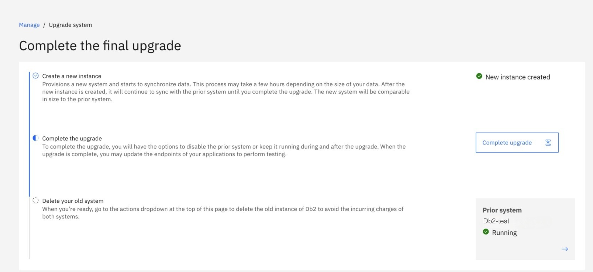
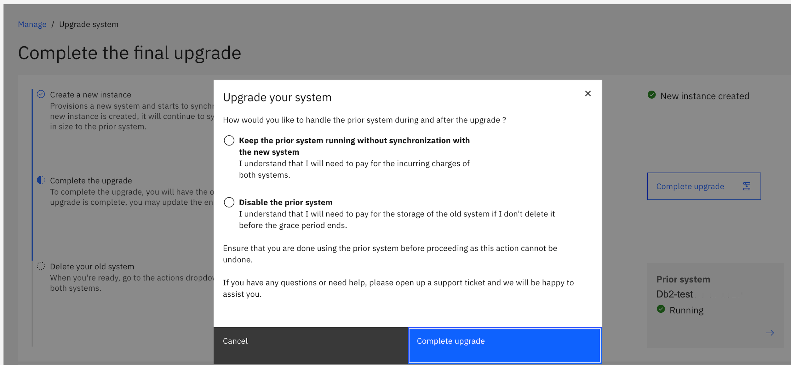

---
copyright:
  years: 2025
lastupdated: "2025-06-26"

keywords:

subcollection: Db2onCloud
---

{:external: target="_blank" .external}
{:shortdesc: .shortdesc}
{:codeblock: .codeblock}
{:screen: .screen}
{:tip: .tip}
{:important: .important}
{:note: .note}
{:deprecated: .deprecated}
{:pre: .pre}

# Migration
{: #migration}

Upgrading your Db2 on Cloud deployment from the **Standard/Enterprise Plan** to the **Performance plan** provides improved scalability, enhanced reliability, and a modern management experience. After you initiate the upgrade, the system automatically provisions a new instance and migrates your data with minimal downtime. The system keeps your two instances in sync until you decide to finalize your upgrade.

Any autoscale settings in **Standard/Enterprise Plan** will need to be recreated in the **Performance** plan after the migration is complete.
{: important}

Follow these steps to begin the migration:

1. Provision your Db2 on Cloud resource from the IBM Cloud catalog if you haven't already.

1. In the **IBM Cloud console**, navigate to your list of resources and click the instance you want to upgrade.

1. At the top of the instance page, look for the notification banner that says **System upgrade available**, on the right-hand side of the  banner, click **Learn More**.
{: caption="Example of the upgrade notification banner in the console." caption-side="bottom"}

1. You will be redirected to the **Upgrade Db2 Systems** page. In the upgrade interface, click **Create Instance**.
{: caption="Example of the Upgrade Db2 Systems page where you create the new instance." caption-side="bottom"}

1. A popup will show showing the parent formation and the new formation's name. Select the location you'd like your instance to be provisioned in. Click **Create** to start provisioning your new upgraded environment.
{: caption="Confirm location and create new instance." caption-side="bottom"}

1. When the new instance has been created, there will be a link to go to the new system to complete the upgrade. Click on **Go to new system to complete upgrade**

1. On the new instance page, there will be a header titled **Action Required** to complete the upgrade. Click the **View Details** button to see the current status and progress of the migration.
    {: caption="Click View Details button." caption-side="bottom"}
    {: caption="Track migration process." caption-side="bottom"}

    The UI is unavailable for the new instance until the upgrade is completed
    {: note}

1. When the process has completed, click the **Complete Upgrade** button
{: caption="Click complete upgrade button." caption-side="bottom"}

1. There will be a popup to finalize and complete the upgrade. There will be an option to keep the prior system running without synchronization with the new system **or** disable the prior instance.
   {: caption="Select what to do with source option and complete upgrade" caption-side="bottom"}

   Keeping both the Standard/Enterprise and Performance plan instances active will result in billing for each environment until the Standard/Enterprise plan instance is deleted.
   {: important}

   If you disable the prior instance, IBM does not charge for that source instance for 14 days. After 14 days, storage charges will begin automatically.
   {: important}

1. When the migration is complete, your deployment is now available in the **Performance** plan.
