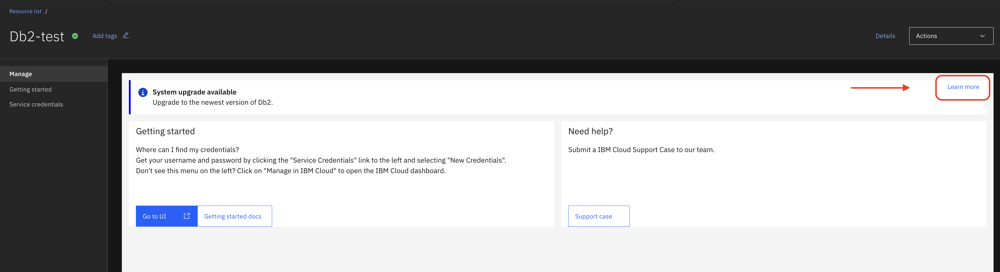
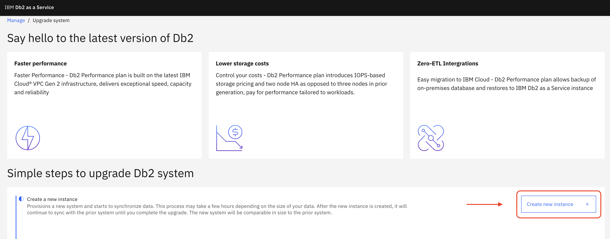
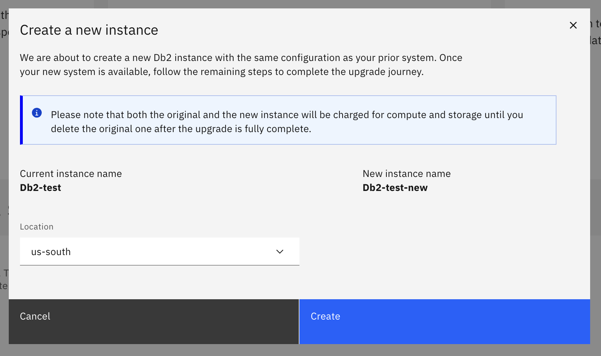
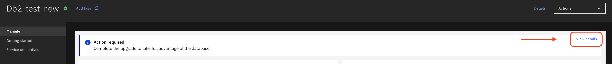
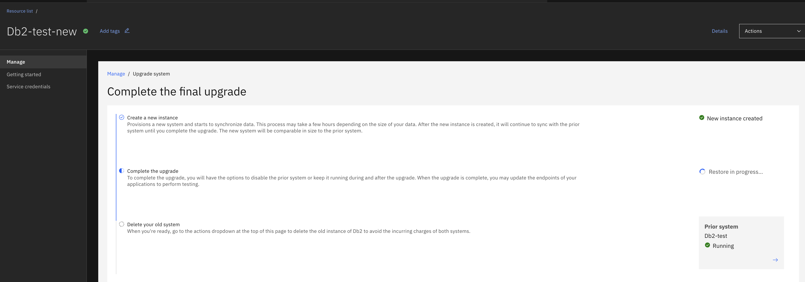

---
copyright:
  years: 2025
lastupdated: "2025-06-26"

keywords:

subcollection: Db2onCloud
---

{:external: target="_blank" .external}
{:shortdesc: .shortdesc}
{:codeblock: .codeblock}
{:screen: .screen}
{:tip: .tip}
{:important: .important}
{:note: .note}
{:deprecated: .deprecated}
{:pre: .pre}

# Migration Initialization
{: #migration_initialization}

Upgrading your Db2 on Cloud deployment from the **Classic plan** to the **MCSP Performance plan** provides improved scalability, enhanced reliability, and a modern management experience. After you initiate the upgrade, the system automatically provisions a new instance and migrates your data with minimal downtime. The system keeps your two instances in sync until you decide to finalize your upgrade.

Follow these steps to begin the migration:

1. Provision your Db2 on Cloud resource from the IBM Cloud catalog if you haven't already.

2. In the **IBM Cloud console**, navigate to your list of resources and click the instance you want to upgrade.

3. At the top of the instance page, look for the notification banner that says **System upgrade available**, on the right-hand side of the banner, click **Learn More**.

{: caption="Example of the upgrade notification banner in the console." caption-side="bottom"}
{:start="4"}

4. You will be redirected to the **Upgrade Db2 Systems** page. In the upgrade interface, click **Create Instance**. A popup will show showing the parent formation and the new formation's name. Select the location you'd like your instance to be provisioned in. Click **Create** to start provisioning your new upgraded environment.

{: caption="Example of the Upgrade Db2 Systems page where you create the new instance." caption-side="bottom"}

{: caption="Confirm location and create new instance." caption-side="bottom"}

Any autoscale settings in **Classic** will need to be recreated in the **Performance** plan after the migration is complete.{: important}
{:start="5"}

5. When the new formation is created, the migration process begins automatically. To track the migration progress:

   - Click the new formation you created.
   - Click the **View Details** button to see the current status and progress of the migration.

{: caption="Click View Details button." caption-side="bottom"}

{: caption="Track migration process." caption-side="bottom"}
{:start="6"}

6. When the migration is complete, your deployment is now available in the **Performance** plan.

Keeping both the Classic and Performance instances active will result in billing for each environment until the Classic instance is deleted.{: important}
