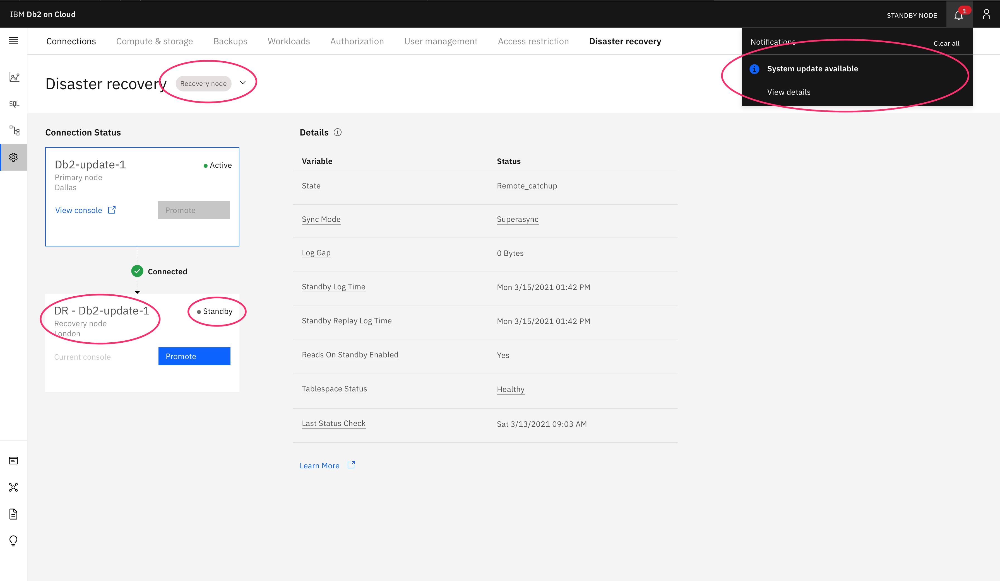
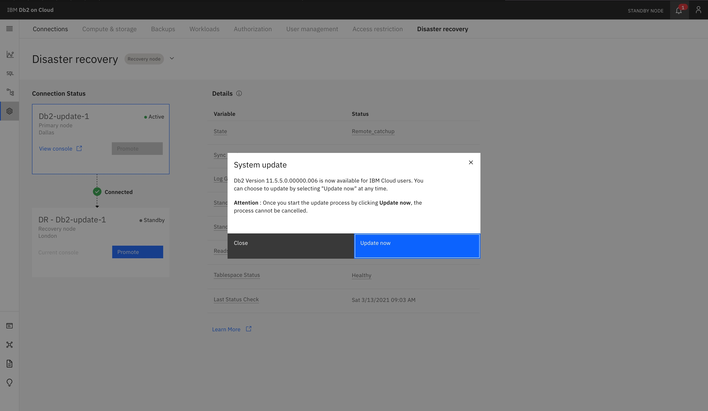
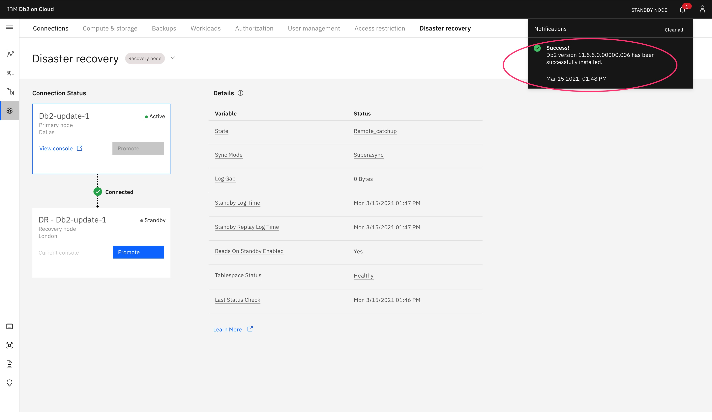
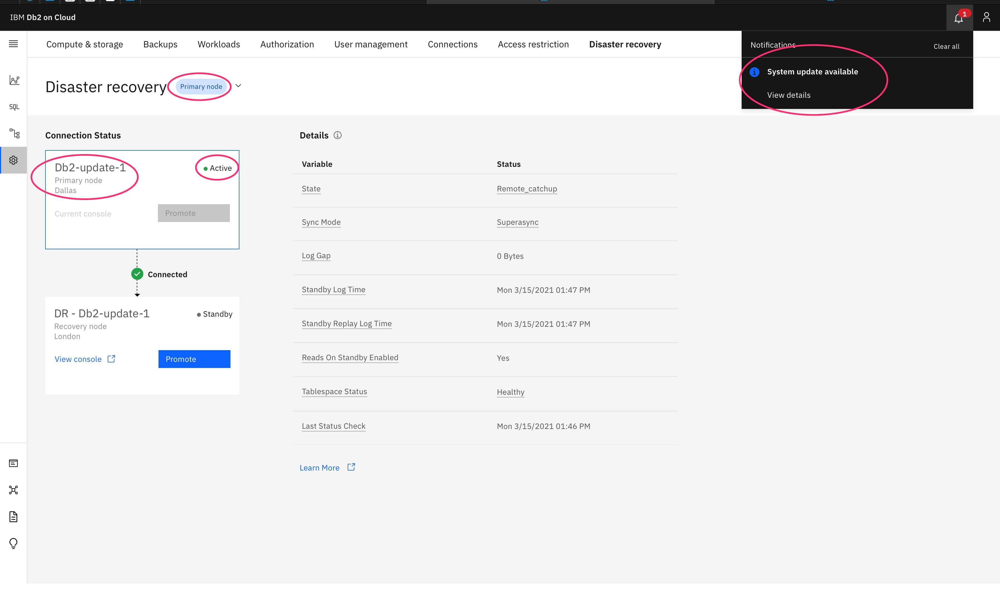
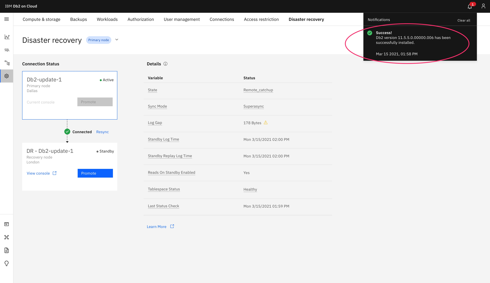

---

copyright:
  years: 2014, 2021
lastupdated: "2021-03-16"

keywords: self-serve, system update, plan

subcollection: Db2onCloud

---

<!-- Attribute definitions --> 
{:external: target="_blank" .external}
{:shortdesc: .shortdesc}
{:codeblock: .codeblock}
{:screen: .screen}
{:tip: .tip}
{:important: .important}
{:note: .note}
{:deprecated: .deprecated}
{:pre: .pre}
{:video: .video}

# Self-serve system updates
{: #self_serve_update}

Many updates on your {{site.data.keyword.Db2_on_Cloud_short}} Enterprise, Standard, or DR instance are offered as self-serve updates, which means that you have the ability to apply system updates to your instances at a time of your choosing. No email notifications are sent for this type of update. You'll be notified through your console. There might be a time limit within which you must apply the update, typically 30 days, before it is automatically applied to your instance.
{: shortdesc}

However, some updates impact all of the users sharing a common infrastructure, or are required immediately to keep your system secure. You can't schedule these updates. Additional details about these types of updates are coming soon.

The update process can be disruptive, especially for single node instances, so it's advisable to run the update during a maintenance window.
{: important}

[Enterprise and Standard plan updates](#ssu_plans)

[DR plan updates](#ssu_dr)

## Enterprise and Standard plan updates
{: #ssu_plans}

Enterprise and Standard plans give you the ability to apply system updates to your instances at a time of your choosing.

### Notification
{: #ssu_notif_se}

For self-serve updates, you are notified of an instance system update through the **Notifications** icon in the upper right of the console.

{: caption="Figure 1. Self-serve update notification" caption-side="bottom"}

Clicking **View details** brings up the **System update** information window that displays the new Db2 version of {{site.data.keyword.Db2_on_Cloud_short}}.  

{: caption="Figure 2. System update information" caption-side="bottom"}

### Updating plans
{: #ssu_updating_se}

You can click **Update now** to initiate the update when you're ready. 

With the update initiated, a progress window is presented under the **Notifications** icon.

{: caption="Figure 3. System update progress" caption-side="bottom"}

### Plan update completion
{: #ssu_fin_se}

Upon completion of a successful update, a **Success!** window appears.

{: caption="Figure 4. Successful Update" caption-side="bottom"}

## DR plan updates
{: #ssu_dr}

Updates to DR instances must always be applied at the **Recovery site** first, while it's in **Standby** mode, before applying to the **Primary site** in **Active** mode.
{: important}

### Notification
{: #ssu_notif_dr}

For self-serve updates, you are notified of an instance system update through the **Notifications** icon in the upper right of the console on both the **Primary** and **Recovery** sites. 

### Update the recovery site first
{: #ssu_recovery_site_first}

The console on the **Recovery node** displays a system update through the **Notifications** icon. The following screenshot shows the console is for the **Recovery node** in London and is in **Standy** mode.

{: caption="Figure 5. Recovery site version update information" caption-side="bottom"}

Clicking **View details** brings up the **System update** information window that displays the new Db2 version of {{site.data.keyword.Db2_on_Cloud_short}}.  

### Updating recovery site
{: #ssu_updating_recovery}

Click **Update now** to initiate the update when you're ready. 

With the update initiated, a progress window is presented under the **Notifications** icon.

{: caption="Figure 6. Recovery site system update information" caption-side="bottom"}

### Recovery site update completion
{: #ssu_recovery_fin}

Upon completion of a successful update, a **Success!** window appears.

{: caption="Figure 7. Recovery site successful update" caption-side="bottom"}

### Update the primary site after updating the recovery site
{: #ssu_primary_site_next}

The console on the **Primary node** displays a system update through the **Notifications** icon.  

The primary site must only be updated when it's **Active** and after the recovery site has been updated first.
{: important}

The following screenshot shows the console is for the **Primary node** in Dallas and is in **Active** mode.

{: caption="Figure 8. Primary site version update information" caption-side="bottom"}

Clicking **View details** brings up the **System update** information window that displays the new Db2 version of {{site.data.keyword.Db2_on_Cloud_short}}. 

### Updating primary site
{: #ssu_updating_primary}

Click **Update now** to initiate the update when you're ready. 

With the update initiated, a progress window is presented under the **Notifications** icon.

{: caption="Figure 9. Primary site system update information" caption-side="bottom"}

### Primary site update completion
{: #ssu_primary_fin}

Upon completion of a successful update, a **Success!** window appears.

{: caption="Figure 10. Primary site successful update" caption-side="bottom"}

